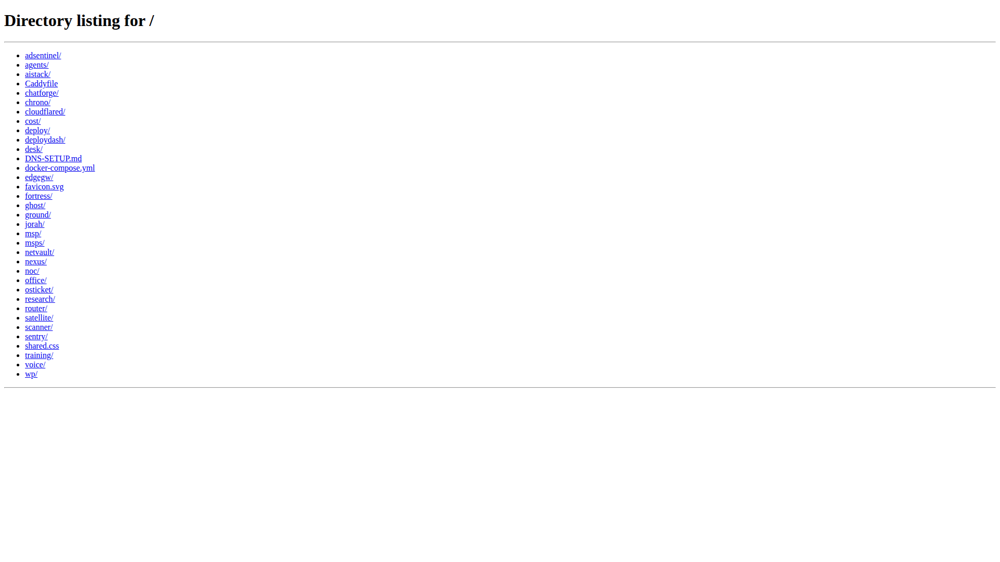

<div align="center">
  
  
  
  
</div>

<br>

<div align="center">
  <h1>🏢 Hermes 3D Office</h1>
  <p><strong>Animated 3D Virtual Office for Hermes AgentOS Subagents</strong></p>
  <p>Real-time isometric visualization of AI agents working, walking, meeting, and more</p>
  <p>
    <a href="#-features">Features</a> •
    <a href="#-quick-start">Quick Start</a> •
    <a href="#-data-sources">Data Sources</a> •
    <a href="#-architecture">Architecture</a>
  </p>
</div>

---

## 📸 Screenshot


*Animated 3D virtual office with real-time Hermes agent visualization*

## ✨ Features

- **3D Agent Visualization** — Animated avatars for Orchestrator, Analyst, Writer, Marketer, Coder
- **Real-Time Updates** — Live agent status via WebSocket, API polling, or webhook push
- **Interactive UI** — Click-to-inspect agents, camera zoom/rotate, chat bubbles
- **Detailed Environment** — Server room, meeting area, kitchen, and more
- **Multiple Data Sources** — Bridge script, API polling, static JSON, webhooks
- **Bridge Script** — Auto-discovers agents from Hermes Gateway API, Session DB, and Kanban

## 🚀 Quick Start

```bash
git clone https://github.com/OneByJorah/hermes-3d-office.git
cd hermes-3d-office
pip install -r requirements.txt
python3 server.py
```

Or with Docker:

```bash
docker-compose up -d
```

Open **http://localhost:8080** in your browser.

## 🔗 Data Sources

| Source | Method | Description |
|--------|--------|-------------|
| Bridge Script | Auto | Auto-discovers agents from Hermes Gateway API |
| API Polling | Configurable | Polls Hermes status API periodically |
| Static JSON | File | Direct consumption of `agents.json` |
| Webhook | POST | Real-time updates via webhook endpoint |

## 🏗️ Architecture

```
hermes-3d-office/
├── server.py                  # Python/Flask backend server
├── public/                    # 3D frontend (Three.js)
├── scripts/                   # Bridge and utility scripts
├── docs/                      # Documentation
├── agents.json.example        # Example agent configuration
├── Dockerfile                 # Container image
├── docker-compose.yml         # Deployment
└── requirements.txt           # Python dependencies
```

## 📄 License

MIT © Jhonattan L. Jimenez

---

<div align="center">
  <p>🤖 Watch your agents come to life in 3D</p>
  <p><a href="https://github.com/OneByJorah">@OneByJorah</a></p>
</div>
